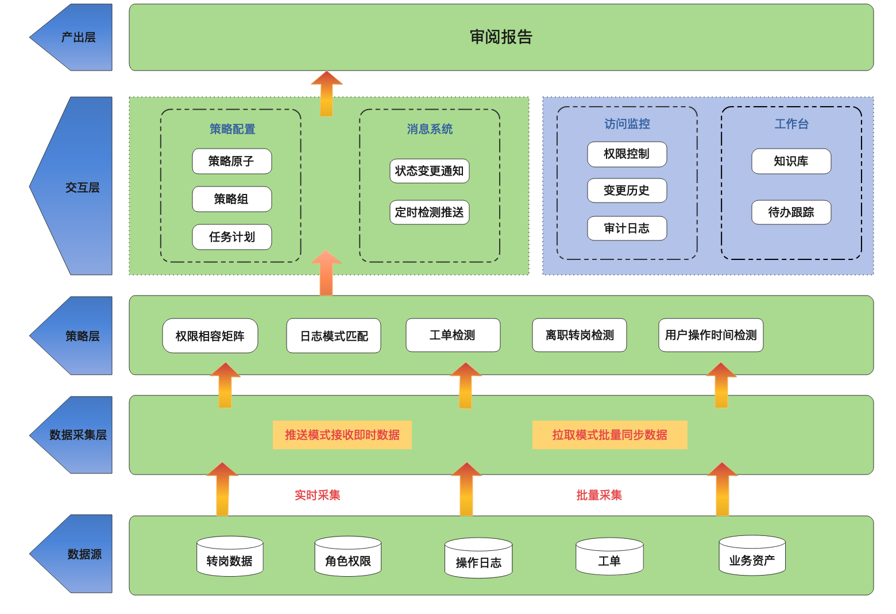
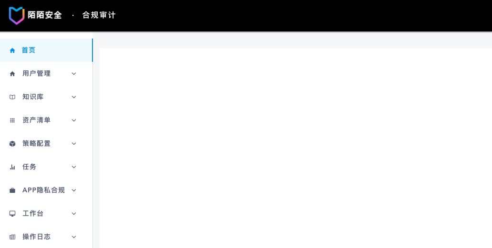
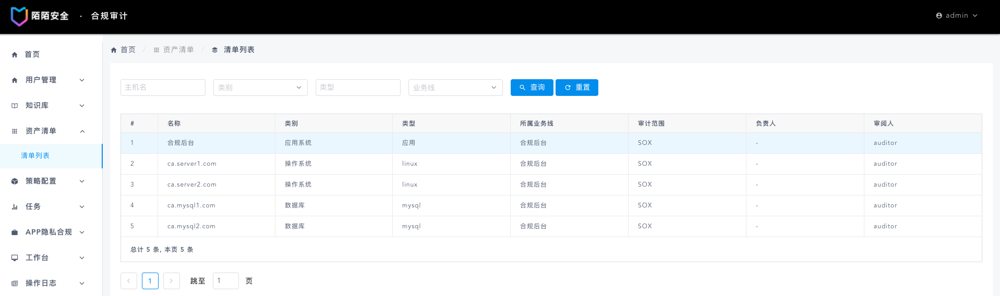
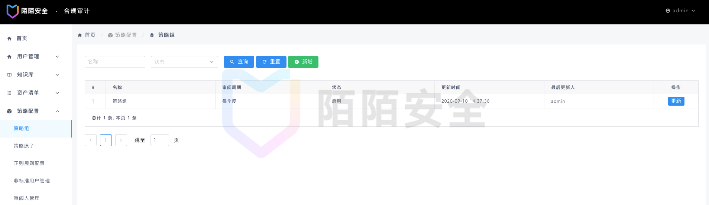
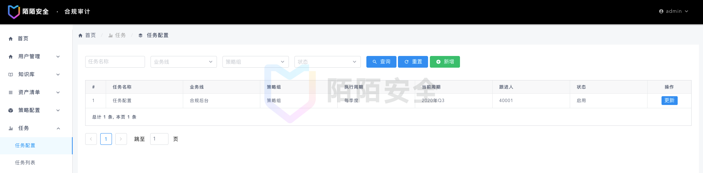
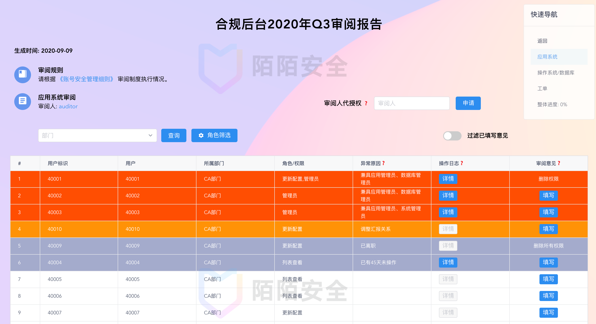
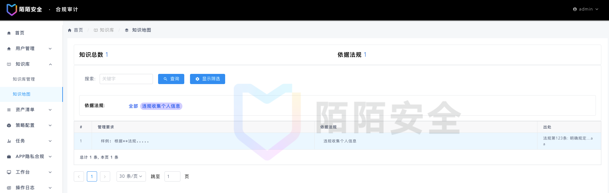

安全合规审计平台
=========

## 项目介绍
近年来，随着监管政策不断细化与收紧，企业安全合规日趋重要。而合规工作的落地，存在大量检查、审计类重复活动，而且随着企业人员和适用政策的叠加，人工成本也会逐渐上升。因此，为解决此类问题，我们设计并实施了安全合规审计系统，将控制落实、合规检查及跟踪汇报等合规审计类流程固化到线上系统，实际使用中起到良好效果。

初始检查策略依据为SOX法案有关要求，适用于在美国上市的公司。企业可根据自身需要配置检查策略。


## 目录
1.  [项目概览](#项目概览)
1.  [后台说明](#后台介绍)
1.  [快速启动](#快速启动)
1.  [关于我们](#关于我们)

## 项目概览
1. 项目概念说明

    项目主旨: 项目旨在检查公司内部生产存在的不合规行为，及时发现及时汇报。覆盖范围包括应用系统、操作系统及数据库三个横向维度，以及员工权限角色、操作日志及工单部署三个纵向维度。从不同的角度切入，对风险行为进行检测，识别风险项。
    
    项目简要概念图说明如下: 
    
    
    如图所示，除去日常工作，最终的产出为审阅报告(<a href='#report'>点击查看</a>)。
    
    名词解释:

    > 业务线: 参与审阅的各个独立的业务部门或职能部门;
    
    > 资产清单: 各业务线的资产，其上承载了用户操作或产品功能，包含主机、数据库实例及运营后台等;
    
    > 策略原子: 对业务线的日志或账号信息等，需要检测日志是否存在危险操作，账号是否有越权等，策略原子为对应的规则。

2. 数据同步简介

    数据同步主要有推拉两种方式，结合要采集数据的集成化程度，选用哪种方式。
    
    目前系统中推拉两种都有采用。数据拉取通过定时任务方式实现，由业务方推送的数据，则通过启用服务接口来实现。
    
    因数据库、服务器主机的命令管理与账号权限信息相对于各业务线基本无差异，这里统一采用了拉取的方式。除此之外，还有资产列表的同步也是使用拉取的方式。
    
    定时任务详情见样例:
    
    > deploy/crontab/crontab_demo.txt
    
    针对应用系统，因各业务方差异较大，则统一采用了推送的方式，由业务方按照指定格式推送数据，完成数据采集。

    接收接口为 `api/audit/common_data`， 其中详情格式定义见`www/audit/utils.py`中字段定义。数据消费交由后台服务`business_bg_log_persistence`。
    
    以其中`UserRoleData` 用户角色数据为例，对接数据格式如下:
    
|字段名|含义|类型|实例|  
|:---:|:---:|:---:|:---:|  
|bg_name|后台名称|string|'ca_bg'|
|role|角色名称|string|'管理员'|
|date|统计日期|string|'2020-01-01'|
|user_details|用户列表|list|[{"user": "11111111", "create_ts": 1580897321}]|

请求样例: 

```
curl --location --request POST 'http://127.0.0.1:60010/api/audit/common_data/' \
--header 'Authorization: Token secret_key_example' \
--header 'Content-Type: application/json' \
--data-raw '{
	"data_type": "UserRoleData",
	"data": [{"bg_name": "ca_bg", "role": "test", "date": "2020-01-01", "user_details": [{"user":"123", "create_ts": 1580897321}]}]
}'
```

3. 代码概述

    代码功能简介见当前目录文件 `CODEVIEW`。

## 后台介绍
1. 概述

    
    
    如果所示，除去用户管理外(管理员可见，不多介绍)，项目总分为七个主目录。其中业务相关部分主要为资产清单、策略配置和任务为合规审计主体部分，知识库为合规的执行标准依据等，APP隐私合规与工作台为合规当前工作提供跟踪记录的作用。
   
2. 资产清单

    
    
    资产作为整个审计流程中最不可缺少的部分，分别包含应用系统的运营后台、数据库的实例和操作系统对应的主机等资产。为整个合规审查的基石, 数据采集的来源。
    这里资产类型分为应用系统、数据库和操作系统。审计范围则对应不同的审计规格。

3. 策略配置

    
    
    如图所示，该部分包含五个子目录，各目录介绍如下:
    
    3.1 正则规则配置
    
    正则规则主要用来对日志中的主机命令、数据库操作日志等进行匹配，筛选可能存在风险的命令(如用户授权等)，该页面可依据于标准正则进行灵活配置，最终将命中日志呈现在审计报告中，以供审阅。
    
    3.2 策略原子
    
    
    
    策略原子目前支持正则命令匹配、权限相容矩阵、长期未访问及转岗异动四种，从不同方面对用户行为进行检测。可以根据需要为不同的审阅任务配置差异化的监控策略。
    
    正则策略原子可以组合【正则规则配置】中的正则规则，统一管理。
    
    3.3 策略组配置
    
    

    策略组可将多个策略原子进行统一管理配置，并可指定审阅周期(目前支持月、季度、半年)，起到一次配置，重复使用的目的。
    
    在任务配置中，可通过对策略组及业务线的组合，完成业务线的任务计划，在特定时间开启目标任务。
    
    3.4 非标准用户管理

    非标准用户指的是由于各种原因，在日志或权限中的用户唯一标识，不能通过标准的方式获取到用户信息。如用户标准名为【姓-名】，但由于历史原因，张三的名字为【张.三】。
    
    3.5 审阅人管理
    
    审阅人对应各个数据库系统、操作系统、应用系统及工单的负责人，在报告生成后，对报告中的问题进行审阅批复等。

4. 任务

    
    
    如图所示，任务分为任务配置与任务列表部分。
    
    4.1 任务配置
    
    任务配置起到执行计划的作用，可以随意搭配业务线与策略组，在指定时期生成审阅任务。为审阅报告的生成主体，与最终的报告一一对应。
    
    4.2 <a name='report'>任务列表</a>
    
    在当前条件(时间等)满足任务配置中的执行计划所需条件时，则生成具体的任务，如为业务线A配置了每季度的审阅任务，则在季度初会自动生成审阅任务。通过任务列表可进入到报告详情页。
    
    

    图中所示为应用系统的审阅页面，显示数据为当前时间点的策略验证结果，针对风险项等情况特别进行标识。

5. 知识库&APP隐私合规&工作台

    
    
    知识库是合规工作开展的基石，涵盖合规工作所依据的法律法规、内部制度等，让合规工作做到有据可依。

    APP隐私合规与待办跟踪是为合规人员记录当前的工作事项及待办事项的记录界面，于此不多介绍。
    


## 快速启动

项目架构概述:
> 项目采用前后端分离结构，后端使用django + mongo + redis，前端使用iViewUI进行界面搭建，前后端交互主要通过使用django rest framework框架实现的REST API接口进行交互。

技术栈:
```bash
mongo + redis + nginx  + python3.6 + iViewUI(node v13.5.0)
```

快速体验: 

>
    注1: 服务端口60010, 确保端口未占用; 
    注2: 默认通过127.0.0.1访问, 如需通过域名或其他IP访问, 请先行修改访问入口配置
        (可通过全局搜索`access domain`查找)
        `HTTPS_HOST`   www/settings/docker.py     (后端)
        `domain`       front/src/config/config.js (前端)

```
# 1. 使用docker方式部署, 确保本机docker环境; 2. 切换至项目目录下
chmod +x run.sh
./run.sh

# 体验入口
访问入口: http://${domain}:60010/     # 默认 http://127.0.0.1:60010/
管理员: (user:admin; password:admin)
审阅人: (user:auditor; password:auditor)
```


## 关于我们

> 陌陌安全致力于以务实的工作保障陌陌旗下所有产品及亿万用户的信息安全，以开放的心态拥抱信息安全机构、团队与个人之间的共赢协作，以自由的氛围和丰富的资源支撑优秀同学的个人发展与职业成长。

陌陌安全应急响应中心：https://security.immomo.com

微信公众号:<br>
<br>
